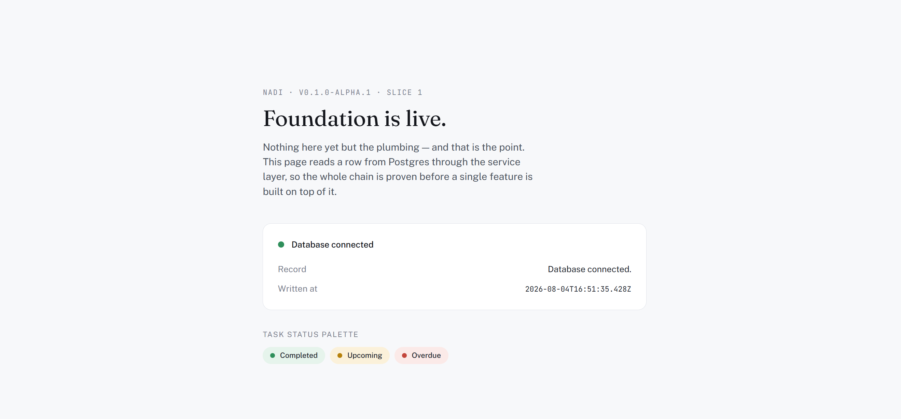
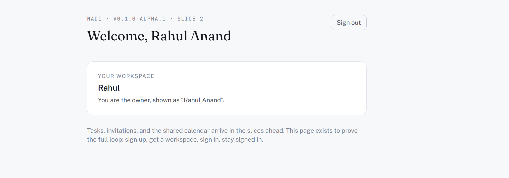
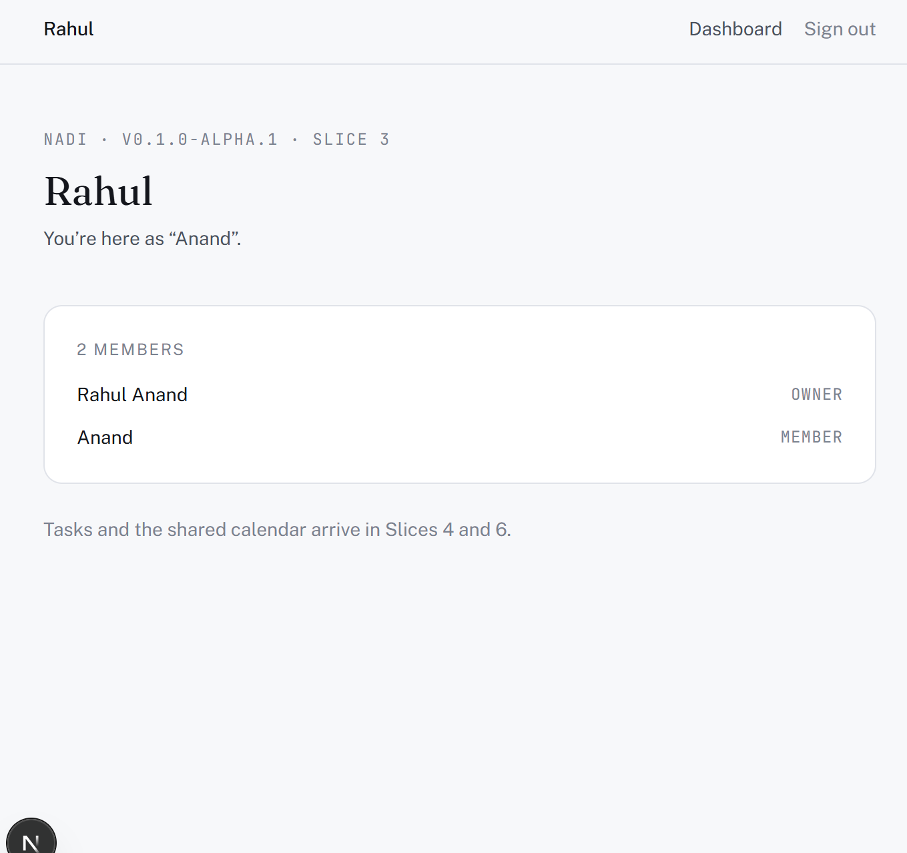
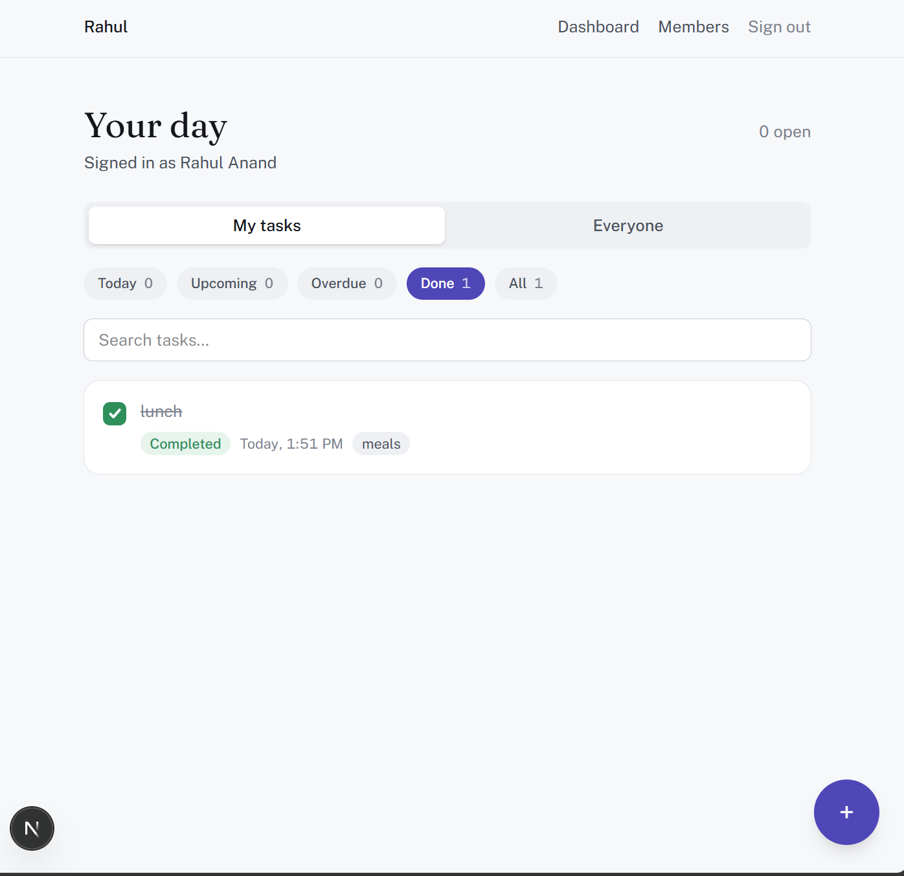
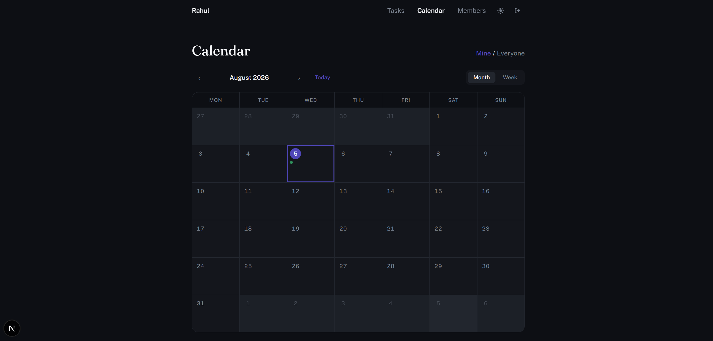
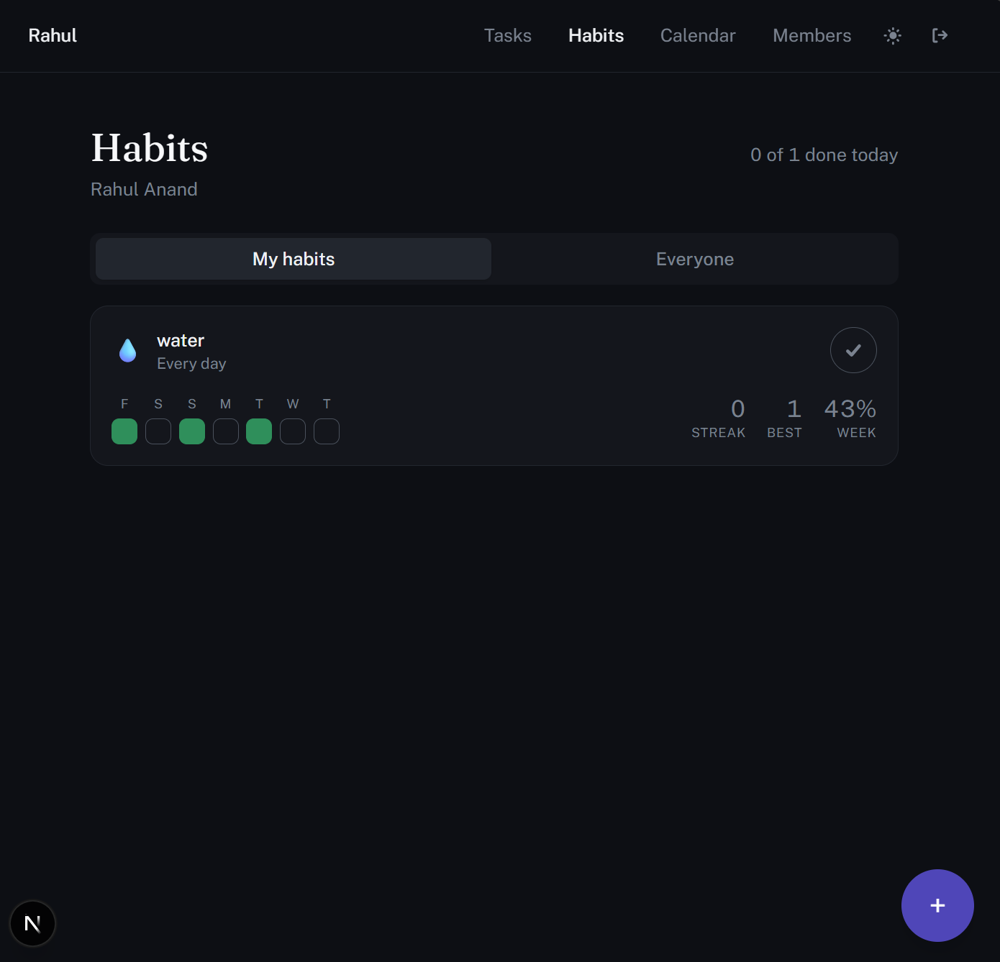

# Nadi

**Shared task and habit tracking for families and small teams.**

Most productivity apps are built for one person, with sharing bolted on later.
Nadi inverts that: an account is a household or a team, members live inside
it, and every task, habit and statistic belongs to a member while remaining
visible to the group.

> **Status: v0.3.0 — feature complete.**
> v0.1 covers accounts, workspaces, invitations, tasks and the calendar. v0.2
> adds recurring tasks, habit tracking with streaks and a contribution graph,
> productivity scoring, and a workspace leaderboard. v0.3 adds a reminders
> engine, an installable PWA with web push, smart rescheduling, scheduling-
> conflict detection, comments on tasks, and a drag-and-drop calendar.

---

## Demo

**Slice 1 — the foundation, live and connected to a real database.**

This page does one thing on purpose: it reads a row from PostgreSQL through
the full request path — page component, service, repository, Prisma — and
renders it. Nothing here is a mock. The green status and timestamp come from
an actual query against a live Neon database, proving the chain end to end
before any feature is built on top of it.

More screenshots land here as each slice ships — see the roadmap below for
what's next.

**Slice 2 — sign up, get a workspace, stay signed in.**

Signing up does two things atomically: creates the account (via Better Auth)
and creates the workspace the account owns (via Nadi's own service layer, kept
deliberately separate — see ADR 005). This screenshot is a real session against
the live database, not a mock: the name, the workspace, and the "owner" role
are all rows that were written moments earlier by the sign-up form.

**Slice 3 — inviting a second person, in real time.**

This dashboard shows two members because an invite link was actually
generated, opened in a separate incognito session, and accepted by a second
real account — not seeded test data. The owner created the invite from the
Members page; the invited account joined through `/invite/[token]`; both
memberships now read from the same `Workspace` row.

**Slices 4 & 5 — tasks, with status derived rather than stored.**

Green, amber and red are never written to the database — they're computed at
read time from `completedAt` and `dueAt` (`src/lib/task-status.ts`), so a task
can't silently go stale the moment its deadline passes. "My tasks" vs
"Everyone" and the filter chips both run against the same live data; the
counts on each chip aren't cached, they're the real result of filtering the
task list currently on screen.

**Slices 6–8 — calendar, dark mode, and the v0.1 release.**

The calendar reuses the same `dueAt` field tasks already had — no new data
model, just a different read of it (`src/lib/calendar.ts`, pure date math, no
dependency). Dark mode is applied by an inline script that runs before first
paint, so there's no flash of the wrong theme on load. Slice 8 added error
boundaries, a proper not-found page for bad or unauthorized workspace URLs,
and [`SECURITY.md`](SECURITY.md), which documents the authorization rules and
the gaps still open at this version rather than leaving them implicit.

**v0.2 — recurring tasks, habits, and streaks.**

Habits are modelled separately from tasks on purpose: a missed task is a
failure to be rescheduled, while a missed day of a habit is just a gap in a
chain, and forcing one set of semantics onto both would serve neither.

The figures above are the non-obvious case, not the flattering one — three days
ticked with gaps between them gives **streak 0** (nothing done today or
yesterday, so no run is live), **best 1** (no two ticked days are adjacent) and
**43%** (three days against a target of seven). Streaks count yesterday as
still alive by design: at 9am, someone who has kept a habit for a month but
hasn't done today's yet has a streak of 30, not 0.

Recurring tasks spawn their next occurrence on completion rather than
pre-generating a year of rows, and advance from the *due date* rather than from
now — so a weekly task completed three days late is next due on schedule
instead of drifting later every cycle.

---

## Why this repository looks the way it does

This project is being built the way a startup would build it: as a sequence of
small, individually deployable increments rather than one large push to a
finished product. Each slice ends with an application that still runs.

That means early commits look sparse on features and heavy on structure. That is
deliberate. The architectural constraints below are cheap to establish now and
expensive to retrofit, and several later features (a React Native client, a
notification worker) depend on getting them right before there is code to
migrate.

---

## Architecture

    src/app/        Routes and UI. Parses input, calls a service, renders.
    src/server/     All business logic. Imports nothing from Next.js or React.
      services/     Domain operations. The only entry point for the app layer.
      repositories/ Database access. The only place Prisma is used.
    src/lib/        Framework-agnostic helpers.

**One rule holds the rest together: `src/server/` must never import from
Next.js, React, or the UI.**

The reason is concrete. In v0.3 a React Native client will call the same
business logic, and the backend may need to move off serverless when scheduled
reminders make cold starts costly. If business logic lives inside route
handlers, both of those are rewrites. If it lives behind a service boundary,
both are configuration changes.

This is enforced by ESLint rather than by convention — see `eslint.config.mjs`.
Importing `next` inside `src/server/`, or importing the database client from a
page, fails the build. A boundary that depends on everyone remembering it is not
a boundary.

### Request path

    page or route handler  ->  service  ->  repository  ->  Prisma  ->  Postgres

Route handlers stay thin: validate input, call a service, map domain errors to
HTTP status codes. Services never know what a 404 is; they raise typed domain
errors (`src/server/errors.ts`) and the app layer translates.

---

## Stack

| Layer | Choice | Reasoning |
| ----- | ------ | --------- |
| Framework | Next.js 15 (App Router) | Server components reduce client bundle; single deploy target |
| Language | TypeScript (strict) | `noUncheckedIndexedAccess` enabled |
| Styling | Tailwind 4 | Design tokens defined once in `globals.css` |
| Database | PostgreSQL (Neon) | Relational — members, assignments, recurrence and analytics are all joins |
| ORM | Prisma | Readable schema, first-class migrations |
| Validation | Zod | Shared between API boundaries and environment config |
| Hosting | Vercel | Zero-config for Next.js; free tier sufficient through v0.2 |

Chosen against React Native for v0.1 despite mobile being the eventual target,
because every feature that genuinely requires native APIs — background
geofencing, reliable push — lands in v0.3 or later. Building the mobile shell
first would have delayed a testable product by weeks. See
`docs/decisions.md` for the full reasoning.

---

## Roadmap

**v0.1 — core platform** (shipped)

| Slice | Scope | State |
| :---: | ----- | ----- |
| 1 | Foundation, deploy pipeline, service-layer boundary | Complete |
| 2 | Database schema and authentication | Complete |
| 3 | Members, invitations, workspace switching | Complete |
| 4 | Task CRUD, assignment, status logic | Complete |
| 5 | Personal and shared dashboards | Complete |
| 6 | Calendar — month and week views | Complete |
| 7 | Dark mode, responsiveness, motion | Complete |
| 8 | Hardening and release | Complete |

**Beyond v0.1**

- **v0.2 — consistency and measurement** *(shipped)*. Recurring tasks, habit
  tracking, streaks, contribution graph, productivity scoring, member
  leaderboards.
- **v0.3 — scheduling and collaboration.** Reminders, smart rescheduling,
  scheduling-conflict detection, drag and drop on the calendar, and comments on
  tasks.
- **v0.4 — AI.** Natural-language and voice task creation, and an assistant
  that answers questions against the user's own tasks and schedule.
- **v0.5 — premium.** Proof-of-completion uploads, push notifications,
  real-time sync between members, location-based reminders (requires the native
  client — see ADR 001).
- **v1.0 — production.** Test coverage, performance and security passes,
  documentation.

Three additions were made to this roadmap after v0.1 shipped, each placed where
it does the most work rather than where it was thought of:

- **Recurring tasks** sit in v0.2 rather than v0.1 because a habit is a
  recurring thing — building both against one recurrence model is cheaper than
  building them twice, but only once the task model has settled in real use.
- **Comments on tasks** sit in v0.3 because the shared-workspace model is the
  product's actual differentiator, and a board people can talk on is a
  different product from a board they can only read.
- **Real-time sync** sits in v0.5 rather than earlier because it is a
  performance and infrastructure change, not a feature — it should land on a
  data model that has stopped moving.

---

## Running locally

Requires Node 20 or later and a PostgreSQL database. A free
[Neon](https://neon.tech) project works.

    git clone https://github.com/Rahulanand112/nadi.git
    cd nadi
    npm install
    cp .env.example .env        # add your connection strings
    npm run db:migrate
    npm run dev

`DATABASE_URL` should be the **pooled** connection string — serverless functions
open many short-lived connections and will exhaust a direct connection limit.
`DIRECT_URL` should be the unpooled one; Prisma Migrate needs it for schema
changes.

### Commands

| Command | Purpose |
| ------- | ------- |
| `npm run dev` | Start the development server |
| `npm run build` | Generate the Prisma client and build for production |
| `npm run typecheck` | Typecheck without emitting |
| `npm run lint` | Lint, including the architectural boundary rules |
| `npm run db:migrate` | Create and apply a migration locally |
| `npm run db:studio` | Browse the database |

### Health check

`GET /api/health` returns database connectivity as JSON. The home page renders
the same check for humans.

---

## What v0.1 actually does

- **Accounts and workspaces.** Sign up, and a household or team is created with
  you as its owner. One person can belong to several, switching between them
  from the header.
- **Invitations.** Owners generate a link; anyone who opens it can sign up and
  join. Links expire after seven days, are single use, and can be revoked.
- **Tasks.** Title, notes, category, priority, due date and time, assigned to
  any member. Tick to complete.
- **Status that can't go stale.** Green, amber and red are computed from
  `completedAt` and `dueAt` on every read rather than stored — a task turns
  overdue on its own, with no background job.
- **Two ways to look at the same work.** A filterable, searchable list
  ("My tasks" or "Everyone"), and a month/week calendar with tasks on their
  due dates.
- **Dark mode** with no flash on load, and a layout that works down to phone
  width.

Security posture, authorization rules, and the known gaps at this version are
documented in [`SECURITY.md`](SECURITY.md).

---

## Design

Task status is fixed to green, amber and red, so the brand accent deliberately
sits far from all three — a primary button must never be mistaken for a
completed task. Status colours are muted rather than saturated: a dashboard
showing thirty tasks should read as calm, not as a wall of traffic lights.

Typography pairs Fraunces for display with Public Sans for interface text, and
JetBrains Mono with tabular figures for times, dates and streak counts, so
digits do not shift position as values update.

---

## Licence

MIT — see `LICENSE`.
